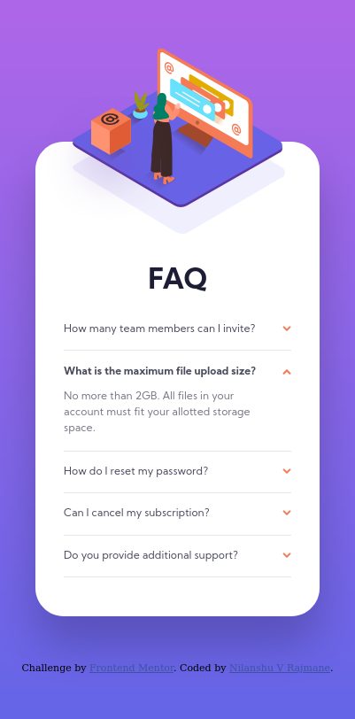

# Frontend Mentor - FAQ accordion card solution

This is a solution to the [FAQ accordion card challenge on Frontend Mentor](https://www.frontendmentor.io/challenges/faq-accordion-card-XlyjD0Oam). Frontend Mentor challenges help you improve your coding skills by building realistic projects. 

## Table of contents

- [Overview](#overview)
  - [The challenge](#the-challenge)
  - [Screenshot](#screenshot)
  - [Links](#links)
- [My process](#my-process)
  - [Built with](#built-with)
  - [What I learned](#what-i-learned)
  - [Continued development](#continued-development)
  - [Useful resources](#useful-resources)
- [Author](#author)

## Overview

### The challenge

Users should be able to:

- View the optimal layout for the component depending on their device's screen size
- See hover states for all interactive elements on the page
- Hide/Show the answer to a question when the question is clicked

### Screenshot

### Links

- Solution URL: [Github](https://github.com/nilanshu96/faq-accordion-card)
- Live Site URL: [Live Website](https://nilanshu96.github.io/faq-accordion-card/)

## My process

### Built with

- Semantic HTML5 markup
- CSS custom properties
- Flexbox
- CSS Grid

### What I learned

I learned to tweak the checkbox input to hide and show elements

### Continued development

I'm planning to create more complex flex and grid layouts. Things to learn from feedback:
- add alt=" " for decorative images and not remove it from img elements. No h1-h6 inside a label tag.
- learn abouth `<detail>` and `
` tags. Link: https://developer.mozilla.org/en-US/docs/Web/HTML/Element/details
- styling of detail tag: https://freefrontend.com/html-details-summary-css/

### Useful resources

- [CSS Tricks](https://css-tricks.com/the-checkbox-hack/) - This helped me hack a checkbox to create a dropdown menu. I really liked this pattern and will use it going forward.

## Author

- Website - [Nilanshu V Rajmane](https://github.com/nilanshu96)
- Frontend Mentor - [@nilanshu96](https://www.frontendmentor.io/profile/nilanshu96)
- Twitter - [@nilanshu96](https://www.twitter.com/nilanshu96)
